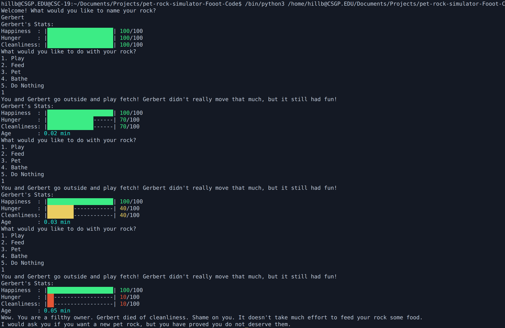
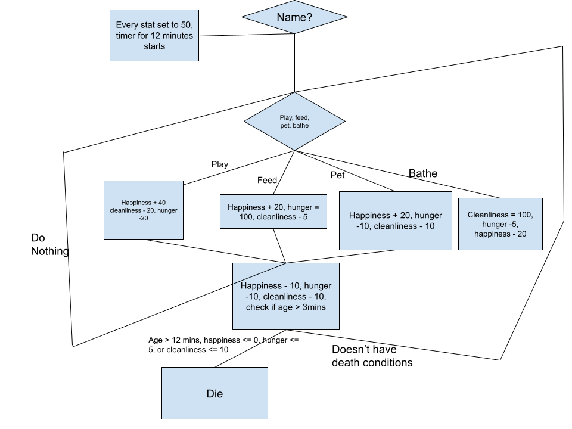

# Pet Rock Simulator
This is a pet rock simulator, where you can own your own pet rock!!! Just make sure to keep it alive :>

## Requirements
 - Python 3 or up
 - colorama version 0.4.6
 - Built In time Library
 - Built In random Library

## Installation and Usage
1. Clone this repo using ```git clone /https://github.com/WTCSC/pet-rock-simulator-Fooot-Code.git```
2. Change your directory to where you cloned the repo
3. Run ```pet_rock.py``` by typing ```python3 pet_rock.py``` or ```python pet_rock.py``` into the terminal

## Example Playthrough


## Flowchart of Decisions


## Possible Outcomes
 - Age Death:
    - Your rock reaches its full lifespan of ROCK_MAX_AGE minutes.
    - Congratulations! You provided good care and let your rock live its full potential.
 - Happiness Death:
    - Your rock’s happiness drops to zero.
    - This happens if you neglect playing or petting it. Your rock “decides” it is not enjoying life — a sad ending.
 - Hunger Death:
    - Your rock’s hunger falls below 5.
    - Forgetting to feed your rock will lead to this tragic outcome. Your rock didn’t get the nourishment it needed.
 - Cleanliness Death:
    - Your rock’s cleanliness drops below 10.
    - Failing to bathe your rock (or making poor hygiene decisions) results in this grim fate.